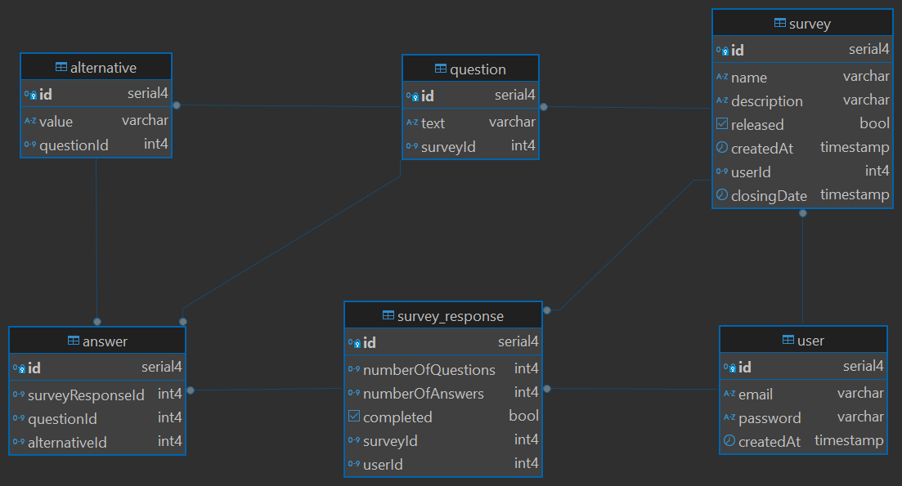

# Survey Manager

The Survey Manager application is designed to create, manage, and respond to surveys efficiently. It provides detailed analytics, including response distributions and percentages for each alternative, giving users valuable insights into survey results.

## Architecture

*Note: This application uses a modular monolithic architecture for simplicity and ease of management while maintaining clear separation of concerns.*

## Key Features

- **Survey Creation**: Create surveys with customizable questions.
- **Survey Responses**: Allow users to respond to surveys, with restrictions to prevent duplicate responses.
- **Detailed Results**: Retrieve survey results, including answer distributions and percentages for each alternative.
- **Role-Based Access Control**: Secure survey management with user authentication and authorization.
- **Date Management**: Configure survey release and closing dates.

## API Documentation

- **Survey Endpoints**: Endpoints to create, update, and delete surveys.
- **Response Endpoints**: Endpoints for users to submit and view responses.
- API Documentation is available via [Swagger], check: "[.../docs]".

## Repositories

- **Survey Manager**: The core backend repository for managing surveys and responses.
- **Front-end (Optional)**: Integration-ready with various front-end technologies for user interfaces.

## License

This project is licensed under the MIT License.
